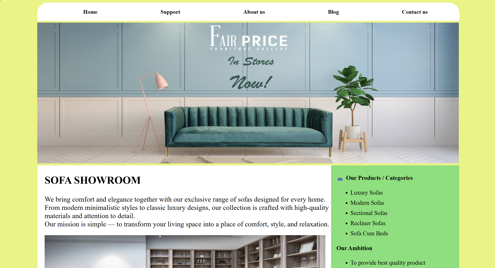

# 🛋️ Sofa Showroom Website

A modern and responsive multi-page Sofa Showroom website developed using HTML and CSS.

## 🚀 Features

- Multi-page Website
- Responsive Navigation Bar
- Home Page
- About Us Page
- Blog Section
- Contact Page
- Warranty & Service Request Form
- Product Categories
- Customer Reviews
- Image Gallery
- Clean and User-Friendly UI

## 📂 Pages Included

### 🏠 Home
Introduction to the showroom, products, and services.

### ℹ️ About Us
Company information, values, vision, and business goals.

### 📝 Blog
Furniture and sofa-related articles and buying guides.

### 🛠️ Support
Warranty and service request form for customers.

### 📞 Contact
Contact form and business information.

## 🛠️ Technologies Used

- HTML5
- CSS3

## 📸 Project Preview

## 🎯 Project Objective

The objective of this project is to design a professional furniture showroom website with multiple pages, clean navigation, and customer support functionality.

## 🔮 Future Improvements

- JavaScript Functionality
- Form Validation
- Product Search
- Shopping Cart
- User Authentication
- Backend Integration

## 👨‍💻 Author

Rajeev Ranjan Kumar

GitHub: https://github.com/rranjank

⭐ If you like this project, consider giving it a star.
